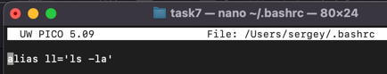

## Использование alias и автодополнение
### Задание:
1. Создайте alias для команды ls -la и назовите его ll.  
2. Напишите команду, чтобы сделать alias постоянным, и объясните, где она должна быть добавлена.  
3. Продемонстрируйте использование автодополнения на примере команды cd.

### Решение:
##### 1. Создание обычного alias – команда в терминале 
`alias ll='ls -la'`
##### 2. Создание постоянного alias 
Чтобы alias был постоянным, нужно добавить его в конфиг файл ~/.bashrc.  
2.1. открываем файл:  
`
nano ~/.bashrc
`  
2.2. добавляем строчку создания alias:  
`
alias ll='ls -la'
`  
2.3. сохраняем файл, обновляем терминал:  
`
source ~/.bashrc
`
##### 3. Демонстрация 
3.1. Временный alias

3.2. Постоянный alias

чистая сессия терминала – все работает :)

